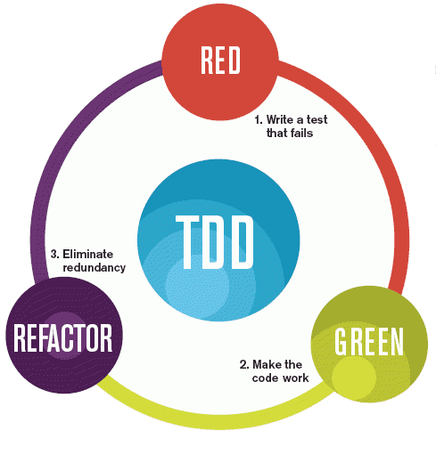
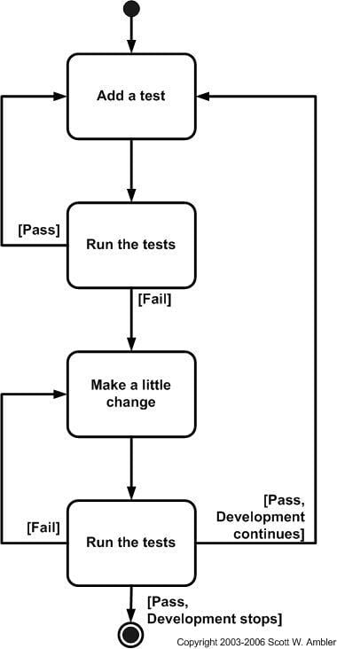
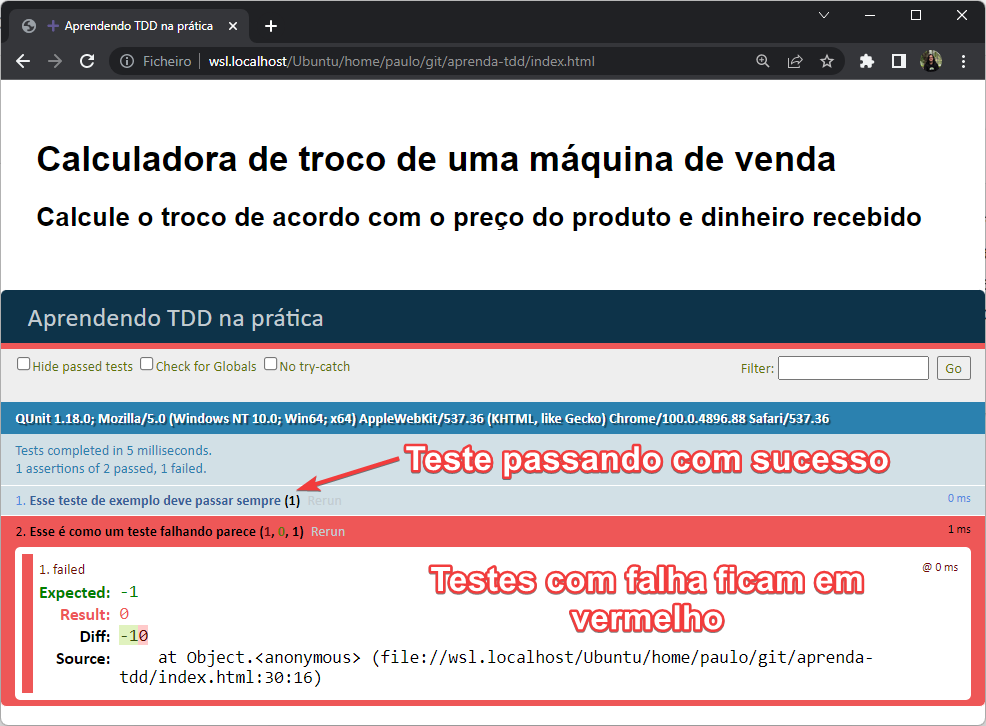
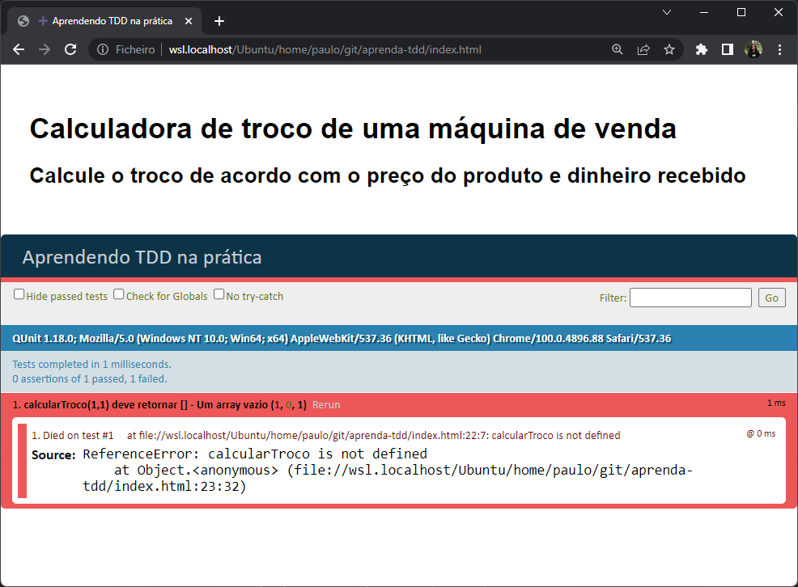
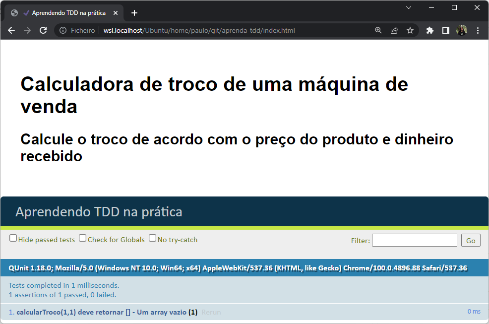
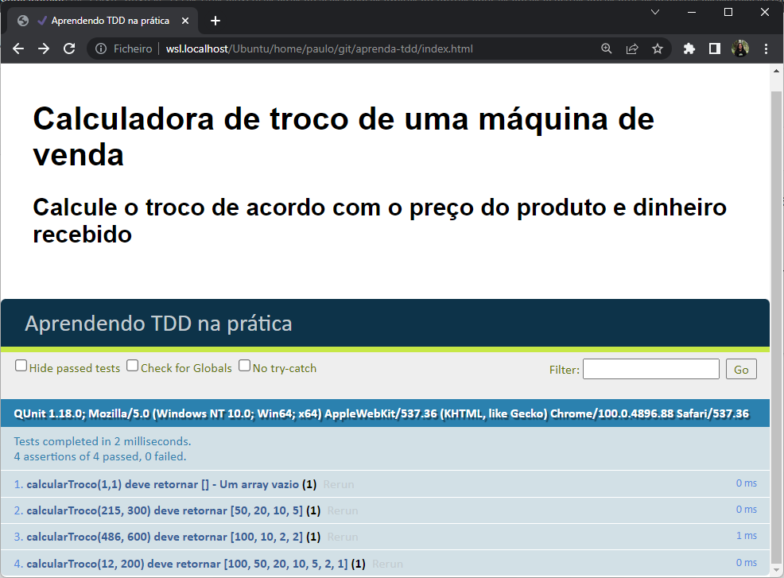

<div align="center">

# Aprenda **T**est **D**riven **D**evelopment (**TDD**) na prática

Uma breve introdução a **T**est **D**riven **D**evelopment (**TDD**)
em JavaScript para pessoas que querem escrever _**códigos mais confiáveis**_

**_Deixe uma star ⭐ no repositório e deixa um follow no [meu perfil](https://github.com/PauloGoncalvesBH), isso me incentiva a criar conteúdo de qualidade de software 100% gratuito_**

</div>

## Sobre o tutorial

Esse tutorial irá te ajudar a dar os primeiros passos com **T**est **D**riven **D**evelopment (**TDD**) durante os próximos 30 minutos.

Como os exemplos apresentados nesse material são pequenos, acredito que você não irá ter a percepção de todas as vantagens que o TDD fornece, necessitando de problemas mais complexos e que possuem uma solução que demandam mais tempo para resolver.

**É difícil demonstrar os benefícios do TDD em um repositório**, o que pretendo apresentar para você nesse material é o ciclo do TDD, fazendo com que você crie o seu primeiro teste antes da codificação da aplicação e entenda que TDD não é sobre testes, mas sobre design de código e criar um código testável.

> Para mais exemplos sugiro a playlist "[Let's Play: Test Driven Development](https://youtube.com/playlist?list=PL0CCC6BD6AFF097B1)", aonde James Shore utiliza o TDD em um projeto real, resultando em 200 vídeos de pura prática do TDD.

### Pré-requisitos

- 30 minutos.
- Conhecimentos básicos em HTML e JavaScript.

### Um pouco sobre testes - Nivelando conhecimento

Antes de entrar no âmbito do TDD, precisamos garantir que temos o conhecimento em 2 coisas:

#### O que é teste de software?

> O teste de software é o processo de avaliação de um item de software para detectar diferenças entre a saída esperada e a saída real. O teste avalia a qualidade do produto. O teste de software é um processo que deve ser feito durante o processo de desenvolvimento. Em outras palavras, o teste de software é um processo de verificação e validação.

#### Nunca criei testes automatizados, como é um teste unitário?

Essa explicação deixo a cargo do [Gabriel Henrique](https://www.linkedin.com/in/gabrielh-silvestre/) em seu didático texto "[Introdução a Testes no Back-end](https://dev.to/gabrielhsilvestre/introducao-a-testes-no-back-end-4la8)".

## O que é TDD?

A primeira coisa que você precisa entender é que escrever código seguindo o TDD é uma abordagem diferente de simplesmente ir e resolver o problema (sem teste).

De acordo com o [Maurício Aniche](https://www.mauricioaniche.com/), TDD é:

> [...] TDD challenges our traditional way of coding, which has always been "write some code and then test it". When doing TDD, we first start by writing a test that represents the next small bit of feature we want to implement. This test naturally fails, as the feature is not yet implemented! We then make the test pass by writing some code. With the test now green, and knowing that the feature is implemented, we look back to the code we just wrote and refactor it.

<!-- _ANICHE, Mauricio. "[Effective Software Testing: A developer's guide](https://www.manning.com/books/effective-software-testing)". 1ª Edição. Editora Manning, 2021_ -->

_Retirado do capítulo "Test-driven development", página 198, do livro "[Effective Software Testing: A developer's guide](https://www.manning.com/books/effective-software-testing)", de autoria do [Maurício Aniche](https://www.mauricioaniche.com/)._

Em uma tradução livre:

> [...] O TDD desafia nossa forma tradicional de codificar, que sempre foi "escrever algum código e depois testá-lo". Ao fazer TDD, primeiro começamos escrevendo um teste que representa a próxima pequena funcionalidade que queremos implementar. Este teste falha naturalmente, pois a funcionalidade ainda não foi implementada! Em seguida, fazemos o teste passar escrevendo algum código. Com o teste agora verde e sabendo que a funcionalidade foi implementada, olhamos para o código que acabamos de escrever e o refatoramos.

Ao ler sobre TDD é comum ver a expressão "***Red, Green, Refactor***" (vermelho, verde e refatorar) como na seguinte imagem:



Isso significa que o TDD é um processo que consiste das seguintes 3 etapas:

1. **Escreva um teste que falhe**: Entenda os requisitos/história bem o suficiente para escrever um teste para o que você espera que seja implementado. Como o teste testa um código que ainda não existe é esperado que ele falhe inicialmente, por isso o vermelho (**red**).

1. **Faça o teste que está falhando passar**: Escreva somente (**SOMENTE**) o código da sua aplicação que é necessário para que o teste que está falhando comece a passar, enquanto garante que os testes anteriores (se possuir) continuem passando. Essa etapa é aonde todos os testes resultam em sucesso, por isso o verde do TDD (**green**).

1. **Refatore o código que você escreveu**: Agora que o código necessário foi escrito e os testes estão passando é o momento para reservar um tempo para refatorar o código, eliminando más práticas e simplificando-o no que for possível, garantindo que esteja manutenível para os que forem mexer no código depois de você. Essa é a etapa de refatoração (**refactor**).

1. **Repita o processo**: Agora que possui um código estruturado, limpo e com teste cobrindo os cenários, siga em frente. Vai implementar mais algum código? Repita as etapas ***red, green, refactor***, senão siga a vida e liga o pay-per-view do BBB.

Escrever um teste que falha antes de escrever o código parece contraintuitivo, perda de tempo ou mesmo algo tedioso inicialmente. Mas precisamos que você pense assim:

> O **teste** é a **pergunta** que você está fazendo. <br>
> O seu **código** é a **resposta** para essa pergunta. <br>
> Ao ter uma pergunta clara você consegue verificar se o seu código está funcionando conforme o esperado
> porque você sempre vai ter as mesmas respostas, mesmo se estiver trabalhando em uma codebase grande

(ok, vamos admitir, não sou muito bom em analogias)

Essa imagem com o ciclo de TDD pode te ajudar a fixar o que viu acima:



### O que TDD não é:

**T**este **D**epois do **D**eploy, isso é uma piada.

### Recomendações de materiais para aprofundar em TDD

- Newsletter "[Effective Software Testing](https://effectivesoftwaretesting.substack.com/)", mantida pelo [Maurício Aniche](https://www.mauricioaniche.com/).
- Livro "[Effective Software Testing](https://www.manning.com/books/effective-software-testing)", do [Maurício Aniche](https://www.mauricioaniche.com/).
- Vídeo "[How to Write Clean, Testable Code](https://www.youtube.com/watch?v=XcT4yYu_TTs)", do canal [Google TechTalks](https://www.youtube.com/channel/UCtXKDgv1AVoG88PLl8nGXmw).
- Livro "[Test Driven Development: By Example](https://www.amazon.com.br/Test-Driven-Development-Kent-Beck/dp/0321146530)", do [Kent Beck](https://www.kentbeck.com/).
- Texto "[When I follow TDD](https://kentcdodds.com/blog/when-i-follow-tdd)", do [Kent C. Dodds](https://kentcdodds.com/).
- Playlist de vídeos "[Let's Play: Test Driven Development](https://youtube.com/playlist?list=PL0CCC6BD6AFF097B1)", do [James Shore](https://www.jamesshore.com/).
<!-- - Practical Full-Stack JavaScript Web Application Test Driven Development - https://github.com/nelsonic/practical-js-tdd -->

## É hora da prática

> Este tutorial pretende ser uma introdução amigável ao TDD para iniciantes.
> O exemplo da máquina de venda automática é relativamente simples
> para que você possa se concentrar nos princípios do TDD.

### Projeto: Calculadora de troco de uma máquina de venda

<p align="center">
 
</p>

Imagine que você está construindo uma **máquina de vendas automática** que permite que as pessoas comprem qualquer item que ele contenha. A máquina aceita moedas e calcula o troco para ser devolvido ao cliente, dado o item **preço** e o **dinheiro** recebido.

### Iniciando o "projeto"

Nós vamos construir o "projeto" inteiro em um arquivo único: `index.html`

No terminal execute o seguinte comando para criar um diretório chamado _maquina-de-venda_ e em seguida acessá-lo:

```sh
  mkcd maquina-de-venda
```

(Esse comando é para Linux, se estiver em Windows crie o diretório da maneira que preferir)

Em seguida crie um arquivo chamado `index.html` dentro do diretório _maquina-de-venda_:

```sh
  touch index.html
```

(Esse comando também é para Linux. Windows? Crie o arquivo como preferir)

Agora copie e cole o seguinte trecho de código dentro do arquivo recém criado `index.html` para iniciar a parte prática:

```html
<html>
  <head>
    <meta http-equiv="Content-Type" content="text/html; charset=UTF-8">
    <title>Aprendendo TDD na prática</title>
    <link rel="stylesheet" href="https://code.jquery.com/qunit/qunit-1.18.0.css">
    <link rel="stylesheet" href="http://yui.yahooapis.com/pure/0.6.0/pure-min.css">
  </head>
  <body>
    <div id='main' style='padding: 2em;'>
      <h1>Calculadora de troco de uma máquina de venda</h1>
      <h2>Calcule o troco de acordo com o preço do produto e dinheiro recebido</h2>
    </div>
    <div id="qunit"></div>
    <div id="qunit-fixture"></div>
    <script src="https://code.jquery.com/qunit/qunit-1.18.0.js"></script>

    <script>
      // A sua solução será escrita aqui!
    </script>

    <script>
      // Isso é o que um pequeno teste unitário parece:
      test('Esse teste de exemplo deve passar sempre', (assert) => {
        const resultado = 1 + 1
        assert.equal(resultado, 2) // apenas para sabermos se tudo está funcionando bem
      })
      // Um teste falhando estará colorido como vermelho:
      test('Esse é como um teste falhando parece', (assert) => {
        const resultado = [1,2,3].indexOf(1)  // O valor de 'resultado' será 0 (zero)
        assert.equal(resultado, -1) // Nós esperamos que essa validação falhe
      })
    </script>

  </body>
</html>
```

Ao abrir o arquivo `index.html` no browser é esperado que veja algo como isso (sem as anotações):

<!-- When you ***open*** `index.html` in your ***web browser***
you should expect to see something like this: (_without the annotation pointing out the qunit div, and the green and red annotations pointing out the Passing and Failing tests_) -->

<p align="center">
 
</p>

Há certa quantidade de código no `index.html` que você criou e preencheu com o código de exemplo. Vamos entender juntos as partes desse arquivo.

O primeiro trecho do `index.html` é um `head` e `body` padrão do HTML:

```html
<html>
  <head>
    <meta http-equiv="Content-Type" content="text/html; charset=UTF-8">
    <title>Aprendendo TDD na prática</title>
    <link rel="stylesheet" href="https://code.jquery.com/qunit/qunit-1.18.0.css">
    <link rel="stylesheet" href="http://yui.yahooapis.com/pure/0.6.0/pure-min.css">
  </head>
  <body>
    <div id='main' style='padding: 2em;'>
      <h1>Calculadora de troco de uma máquina de venda</h1>
      <h2>Calcule o troco de acordo com o preço do produto e dinheiro recebido</h2>
    </div>
```

Nada especial aqui, estamos fazendo o setup da página e carregando os arquivos CSS.

Em seguida nós vemos os `div`s qunit (onde os resultados dos testes são exibidos) e carregamos as bibliotecas JQuery e QUnit do CDN:

```html
    <div id="qunit"></div>
    <div id="qunit-fixture"></div>
    <script src="https://code.jquery.com/qunit/qunit-1.18.0.js"></script>
```

Chegamos na seção aonde escreveremos a solução da pergunta que queremos responder mais à frente (lembra da analogia?):

```html
    <script>
      // A sua solução será escrita aqui!
    </script>
```

Finalmente nós vemos os testes, essa é a parte interessante do arquivo (teste é sempre interessante, não concorda? <3):

```html
    <script>
      // Isso é o que um pequeno teste unitário parece:
      test('Esse teste de exemplo deve passar sempre', (assert) => {
        const resultado = 1 + 1
        assert.equal(resultado, 2)
      })

      // Um teste falhando estará colorido como vermelho:
      test('Esse é como um teste falhando parece', (assert) => {
        const resultado = [1,2,3].indexOf(1)  // O valor de 'resultado' será 0 (zero)
        assert.equal(resultado, -1) // Nós esperamos que essa validação falhe
      })

    </script>
  </body>
</html>
```

> Os testes estão rodando no browser com [QUnit](https://qunitjs.com/) para que você utilize apenas o editor de código e o browser, sem preocupar com nenhum `docker run`, `npm install`, `pip install`, etc. Apenas crie o `index.html`, realize as tarefas comigo preenchendo o arquivo e aprenda TDD no processo.

## Requisitos

Como um cliente eu quero comprar um item na **máquina de vendas automática** e ver quanto de troco vou receber como **resultado** da compra entre as **cédulas disponíveis**, então eu posso selecionar um item e receber o meu troco.

> Nota: Essa máquina aceita apenas cédulas e o preço dos itens é sempre um valor inteiro.

<!-- As a customer, I want to buy a selected item from the **vending machine**
and see what my change is as a **result** into the various **coins**
so that I can select one of the options and receive my change. -->

Critérios de aceitação:
- Uma chamada bem sucedida da função `calcularTroco` deve retornar o valor do troco entre as **cédulas disponíveis**.
- Testes unitários devem existir quando a função for finalizada.
<!-- - The selection of the desired return is out of scope -->

##### Visualização complementar da User Story

> Dado um **preço do produto** e uma quantidade de **valor pago** pelo cliente
> Retorno: **Troco** que o usuário deve receber (entre as cédulas disponíveis)

### Entendendo o que é preciso

- Crie uma função chamada `calcularTroco` que aceita 2 parâmetros:
    - `precoDoProduto`
    - `valorPago`
- Para um dado `precoDoProduto` (o valor total que um item custa na máquina de vendas) e `valorPago` (o dinheiro que o cliente inseriu na máquina de vendas para pagar pelo item), a função `calcularTroco` deve calcular o troco que a máquina deve retornar para o cliente.
- A função `calcularTroco` deve retornar o troco como um _array_ de cédulas (do maior valor ao menor) que a máquina de vendas automática precisa entregar ao cliente.

#### _Exemplo_

Se o cliente comprar um item que custa R$ 2,00 (`precoDoProduto`) e pagar com cédula de R$ 10,00 (`valorPago`), a máquina deve devolver de troco R$ 8,00.

A dispensa de trocos da máquina irá devolver 3 cédulas: R$ 5,00, R$ 2,00 e R$ 1,00.

Um array desse troco será igual a `[5, 2, 1]`.

#### Cédulas

Nós temos as seguintes 7 cédulas disponíveis:

<p align="center">
 . Acesso em: 31 dez. 2021" src="./images/cedulas-brasileiras.jpg" height="400">
</p>

Que podem ser armazenadas em um array da seguinte forma:

```js
const cedulasDisponiveis = [100, 50, 20, 10, 5, 2, 1]
```

In **T**est **F**irst **D**evelopment (TFD) we write a test *first* and *then*
write the code that makes the test pass.

#### Implementando o primeiro requisito

> Relembrando: No **TDD** primeiro escrevemos o teste e depois escrevemos o código que faz o teste passar.

De volta ao arquivo `index.html`, substitua os testes existentes (apagando o que está dentro da seção `<script></script>` que possui `test`s) com as seguintes linhas:

```js
      test('calcularTroco(1,1) deve retornar [] - Um array vazio', (assert) => {
        const trocoCalculado = calcularTroco(1, 1) // Sem troco, apenas um array vazio
        const trocoEsperado = []
        assert.deepEqual(trocoCalculado, trocoEsperado) // 'deepEqual' usado para comparar arrays, veja mais em https://api.qunitjs.com/assert/deepEqual/
      })
```

Nesse ponto o seu arquivo `index.html` deve ser semelhante a isso:

```html
<html>
  <head>
    <meta http-equiv="Content-Type" content="text/html; charset=UTF-8">
    <title>Aprendendo TDD na prática</title>
    <link rel="stylesheet" href="https://code.jquery.com/qunit/qunit-1.18.0.css">
    <link rel="stylesheet" href="http://yui.yahooapis.com/pure/0.6.0/pure-min.css">
  </head>
  <body>
    <div id='main' style='padding: 2em;'>
      <h1>Calculadora de troco de uma máquina de venda</h1>
      <h2>Calcule o troco de acordo com o preço do produto e dinheiro recebido</h2>
    </div>
    <div id="qunit"></div>
    <div id="qunit-fixture"></div>
    <script src="https://code.jquery.com/qunit/qunit-1.18.0.js"></script>

    <script>
      // A sua solução será escrita aqui!
    </script>

    <script>
      test('calcularTroco(1,1) deve retornar [] - Um array vazio', (assert) => {
        const trocoCalculado = calcularTroco(1, 1) // Sem troco, apenas um array vazio
        const trocoEsperado = []
        assert.deepEqual(trocoCalculado, trocoEsperado) // 'deepEqual' usado para comparar arrays, veja mais em https://api.qunitjs.com/assert/deepEqual/
      })
    </script>

  </body>
</html>
```

#### Veja o teste falhar

De volta ao browser, atualize a página e veja o teste falhar:

<p align="center">
 
</p>

> **Pergunta:** Porque deliberadamente escrever um teste que sabemos que irá falhar? <br>
> **Resposta:** Para acostumarmos com a ideia de **somente** escrever o código necessário para fazer o teste passar e os requisitos serem cumpridos. <br>

#### Crie a função `calcularTroco`

No seu arquivo `index.html` adicione as seguintes linhas no `<script></script>` que está acima dos testes:

```js
    <script>
      function calcularTroco(precoDoProduto, valorPago) {
        let troco = []
        // o seu código com a solução será escrito aqui
    
        return troco
      }
    </script>
```

O seu `index.html` deve ser semelhante a isso:

```html
<html>
  <head>
    <meta http-equiv="Content-Type" content="text/html; charset=UTF-8">
    <title>Aprendendo TDD na prática</title>
    <link rel="stylesheet" href="https://code.jquery.com/qunit/qunit-1.18.0.css">
    <link rel="stylesheet" href="http://yui.yahooapis.com/pure/0.6.0/pure-min.css">
  </head>
  <body>
    <div id='main' style='padding: 2em;'>
      <h1>Calculadora de troco de uma máquina de venda</h1>
      <h2>Calcule o troco de acordo com o preço do produto e dinheiro recebido</h2>
    </div>
    <div id="qunit"></div>
    <div id="qunit-fixture"></div>
    <script src="https://code.jquery.com/qunit/qunit-1.18.0.js"></script>

    <script>
      function calcularTroco(precoDoProduto, valorPago) {
        let troco = []
        // o seu código com a solução será escrito aqui
    
        return troco
      }
    </script>

    <script>
      test('calcularTroco(1,1) deve retornar [] - Um array vazio', (assert) => {
        const trocoCalculado = calcularTroco(1, 1) // Sem troco, apenas um array vazio
        const trocoEsperado = []
        assert.deepEqual(trocoCalculado, trocoEsperado) // 'deepEqual' usado para comparar arrays, veja mais em https://api.qunitjs.com/assert/deepEqual/
      })
    </script>

  </body>
</html>
```


#### Atualize o `index.html` no browser

<p align="center">
 
</p>

O teste passou!! :partying_face: :partying_face:

#### Agora vamos escrever um teste real

De volta aos requisitos, nós precisamos que o método `calcularTroco` aceite 2 parâmetros (`precoDoProduto` e `valorPago`) e retorne um array contendo as cédulas que correspondem à diferença entre os parâmetros:

Exemplo:

```js
precoDoProduto = 2         // R$ 2,00
valorPago      = 10        // R$ 10,00
diferenca      = 8         // R$ 8,00
trocoCalculado = [5, 2, 1] // R$ 5,00, R$ 2,00 e R$ 1,00
```

Adicione o seguinte teste na seção de testes do `index.html`:

```js
      test('calcularTroco(215, 300) deve retornar [50, 20, 10, 5]', (assert) => {
        const trocoCalculado = calcularTroco(215, 300) // Esperado um array contendo [50, 20, 10, 5]
        const trocoEsperado = [50, 20, 10, 5]
        assert.deepEqual(trocoCalculado, trocoEsperado)
      })
```

#### Implemente a função para o teste passar

E se trapacearmos e fazermos o `calcularTroco` retornar o resultado esperado?

```js
      function calcularTroco(precoDoProduto, valorPago) {
        let troco = [50, 20, 10, 5] // Necessário para o teste que está falhando começar a passar

        return troco
      }
```

Issi irá fazer o novo teste passar (:partying_face:), mas também irá introduzir uma regressão. O teste original `calcularTroco(1,1) deve retornar [] - Um array vazio (1, 0, 1)` agora está falhando.

O passo 2 do **TDD** (o _green_) requer que TODOS os testes devem passar, e não apenas o teste novo.

A função `calcularTroco` precisa atender a 2 cenários de testes, que são quando um troco deve ser retornado e quando não deve ser. Uma nova implementação de `calcularTroco` que lida com ambos os cenários é a seguinte:

```js
      function calcularTroco(precoDoProduto, valorPago) {
        let troco = []

        if((valorPago - precoDoProduto) != 0) { // Precisa fornecer algum troco?
          troco = [50, 20, 10, 5] // Necessário para o teste que está falhando começar a passar
        }

        return troco
      }
```

A regressão foi corrigida e todos os testes estão passando, mas você fixou o resultado, o que não é muito útil para uma calculadora.

Isso irá funcionar apenas 1 vez. Quando escrevermos o próximo teste será preciso reescrever o método para satisfazer esse novo cenário.

Vamos tentar então, temos o seguinte cenário:

<!-- Let's try it.  Work out what you expect so you can write your test: -->

```js
precoDoProduto = 486           // R$ 486,00
valorPago      = 600           // R$ 600,00
diferenca      = 114           // R$ 114,00
trocoCalculado = [100, 10, 2, 2]  // R$ 100,00, R$ 10,00, e 2 cédulas de R$ 2,00
```

Adicione o seguinte teste ao `index.html` e atualize o seu browser:

```js
      test('calcularTroco(486, 600) deve retornar [100, 10, 2, 2]', (assert) => {
        const trocoCalculado = calcularTroco(486, 600)
        const trocoEsperado = [100, 10, 2, 2]
        assert.deepEqual(trocoCalculado, trocoEsperado)
      })
```
#### Devemos continuar trapaceando ou resolver o problema?

Nós podemos continuar trapaceando escrevendo uma série de condicionais `if`:

```js
      function calcularTroco(precoDoProduto, valorPago) {
        let troco = []

        if ((valorPago - precoDoProduto) != 0) { // Precisa fornecer algum troco?
          if (precoDoProduto == 486 && valorPago == 600) {
            troco = [100, 10, 2, 2]
          } else if (precoDoProduto == 215 && valorPago == 300) {
            troco = [50, 20, 10, 5]
          }
        }

        return troco
      }
```

É, sem dúvida, mais trabalhoso trapacear do que resolvermos o problema de vez. Então vamos resolvê-lo.

# Experimente você mesmo (_antes de olhar para a solução_!)

> Tente criar o seu próprio método `calcularTroco` que passa ,os 3 testes antes de olhar a solução final.

Recapitulando, esses são os nossos 3 testes:

```js
      test('calcularTroco(1,1) deve retornar [] - Um array vazio', (assert) => {
        const trocoCalculado = calcularTroco(1, 1) // Sem troco, apenas um array vazio
        const trocoEsperado = []
        assert.deepEqual(trocoCalculado, trocoEsperado)
      })

      test('calcularTroco(215, 300) deve retornar [50, 20, 10, 5]', (assert) => {
        const trocoCalculado = calcularTroco(215, 300) // Esperado um array contendo [50, 20, 10, 5]
        const trocoEsperado = [50, 20, 10, 5]
        assert.deepEqual(trocoCalculado, trocoEsperado)
      })

      test('calcularTroco(486, 600) deve retornar [100, 10, 2, 2]', (assert) => {
        const trocoCalculado = calcularTroco(486, 600)
        const trocoEsperado = [100, 10, 2, 2]
        assert.deepEqual(trocoCalculado, trocoEsperado)
      })
```

Agora foque no `index.html` e altere o `calcularTroco` para passar nos 3 testes sem nenhuma forma de trapaça (xô compilado de `ifs`). Volte aqui quando acreditar que o cálculo de troco está funcionando corretamente nos cenários propostos.

Finalizou? Vamos seguir então.

#### Vamos inserir mais um teste para ter certeza que funciona?

Vamos criar um teste que irá returnar uma de cada cédula. Relembrando que temos 7 tipos de cédulas:

```js
const cedulasDisponiveis = [100, 50, 20, 10, 5, 2, 1]
```

A soma das cédulas (array contendo 1 cédula de cada) é igual a 188.

Então precisamos criar um teste em que iremos pagar R$ 200,00 para um item que custa R$ 12,00. (Um pouco irreal, mas é para sabermos se o método `calcularTroco` está pronto para ir para produção).

```js
      test('calcularTroco(12, 200) deve retornar [100, 50, 20, 10, 5, 2, 1]', (assert) => {
        const trocoCalculado = calcularTroco(12, 200)
        const trocoEsperado = [100, 50, 20, 10, 5, 2, 1]
        assert.deepEqual(trocoCalculado, trocoEsperado)
      })
```

Se todos os testes passarem, o seu trabalho está finalizado. :partying_face: :partying_face: Parabéns.

<br><br><br><br>

## Solução

**Nota:** Sinta-se à vontade para sugerir uma solução mais compacta.

```js
      const cedulasDisponiveis = [100, 50, 20, 10, 5, 2, 1]
      function calcularTroco(precoDoProduto, valorPago) {
        let diferenca = valorPago - precoDoProduto
        let troco = []

        cedulasDisponiveis.forEach((cedula) => {
          // Continuar adicionando a cédula atual enquanto for maior que a diferença
          while (diferenca >= cedula) {
            troco.push(cedula)
            diferenca = diferenca - cedula
          }
        })

        return troco
      }
```

Se você viu isso no browser:

<p align="center">
 
</p>

_**Parabéns! Você pode fazer Test Driven Development (TDD)!!**_

---

**_Aprendeu algo com o material? É quase de graça, basta deixar uma star ⭐ no repositório e um follow no [meu perfil](https://github.com/PauloGoncalvesBH), isso me incentiva a criar conteúdo de qualidade de software 100% gratuito_**
